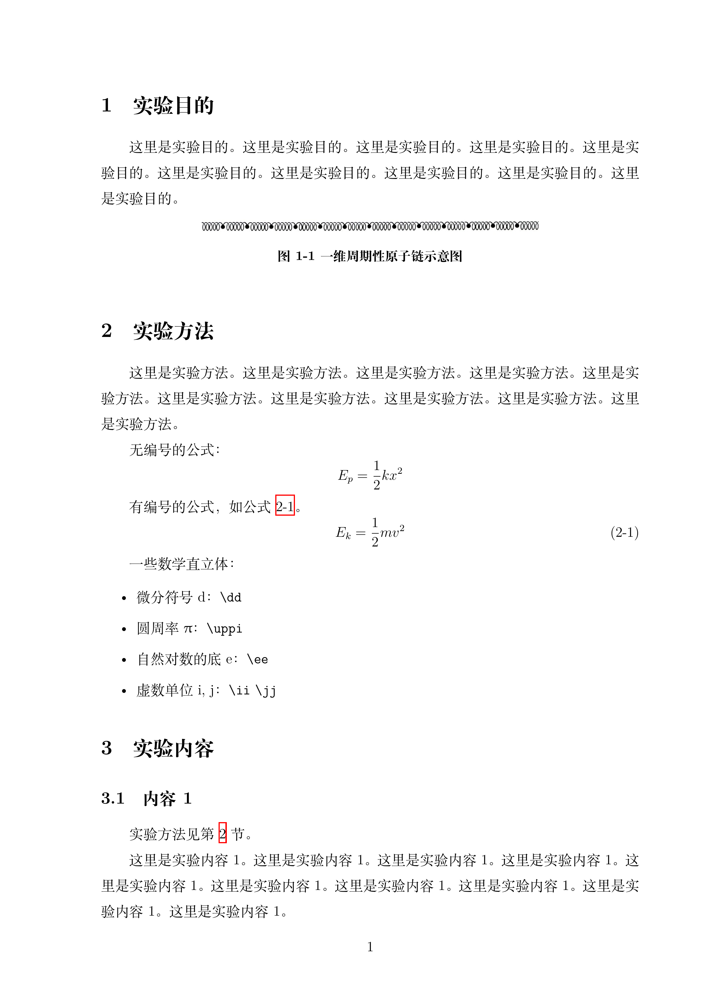

# 《多尺度材料模拟与计算》作业 LaTeX 模板

- 作者：小小角色
- 创建时间：2023.10.07
- 以下内容如有错误或疑问，或友好交流互动，请在该 repo 中提 [Issues](https://gitee.com/yangsl306/homework-template-MMMS/issues/new)
- 本模板内容较为简略，欢迎感兴趣、有能力的同学对其进行丰富扩展

---

## LaTeX 文档编译

>只在 Linux 端测试过，Windows 端请自行测试（应该不难）。

### Makefile 编译

```bash
# 生成 pdf 并删除中间文件
make
# make auto

# 打印帮助信息
make help

# 生成 pdf
make all

# 删除中间文件
make clean

# 删除中间文件、pdf
make cleanall
```

### 手动编译

```bash
# 方式 1
latexmk -xelatex -time -halt-on-error main.tex

# 方式 2
./run.sh
```

---

## 文档内容

完整文档内容见 [main_v0.0.0_20231007.pdf](./main_v0.0.0_20231007.pdf)。



---

## To do

- [ ] 待完善
