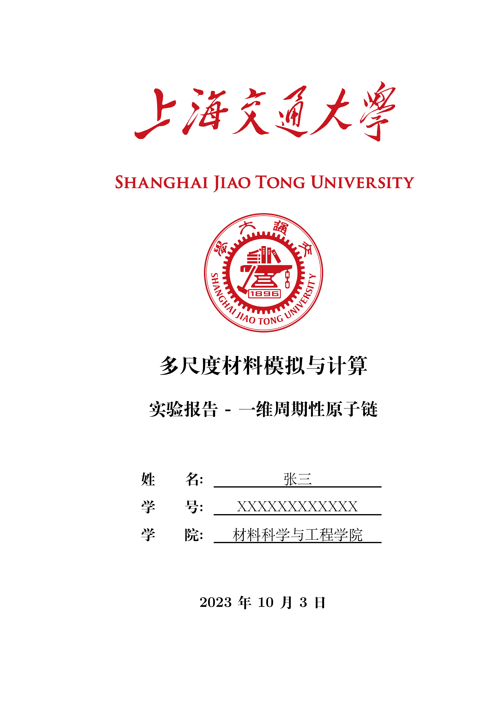

# 《多尺度材料模拟与计算》实验报告 LaTeX 模板

- 作者：小小角色、走楼梯啊
- 创建时间：2023.10.03
- 本模板 tex 文件结构、内容主要参考 [SJTUThesis](https://github.com/sjtug/SJTUThesis)
- 以下内容如有错误或疑问，或友好交流互动，请在该 repo 中提 [Issues](https://gitee.com/yangsl306/report-template-MMMS/issues/new)
- 本模板内容较为简略，欢迎感兴趣、有能力的同学对其进行丰富扩展

---

## 文档结构

```txt
├── assets
│   ├── Figures
│   ├── Icons
├── contents
│   ├── abstract.tex
│   ├── appendix.tex
│   ├── content.tex
│   └── cover.tex
├── main.tex
├── refs.bib
└── setup.tex
```

- `main.tex` - 主文件，编译该文件即可生成 pdf（**基本不用修改**）
- `setup.tex` - 配置 tex 文件，包含宏包及其设置、部分命令设置等（**基本不用修改**）
- `contents/` - 存放文档各部分的 tex 文件，如封面、摘要、正文、附录等（**在此部分进行修改**）
  - `cover.tex` - 修改封面文字信息，如实验报告名称、姓名和学号
  - `abstract.tex` - 如果需要写摘要，请在 `main.tex` 文件取消相应注释
  - `content.tex` - 正文部分，根据需要添加、删除内容
  - `appendix.tex` - 附录部分，根据需要添加、删除内容，如代码
- `refs.bib` - 参考文献 bib 文件（**有则在此修改**）
- `assets/` - 存放文档封面、数据图片等图片文件（**在此添加数据图片**）

---

## LaTeX 文档编译

>只在 Linux 端测试过，Windows 端请自行测试（应该不难）。

### Makefile 编译

```bash
# 生成 pdf 并删除中间文件
make
# make auto

# 打印帮助信息
make help

# 生成 pdf
make all

# 删除中间文件
make clean

# 删除中间文件、pdf
make cleanall
```

### 手动编译

```bash
# 方式 1
latexmk -xelatex -time -halt-on-error main.tex

# 方式 2
./run.sh
```

---

## 文档内容

完整文档内容见 [main_v0.0.2_20231003.pdf](./main_v0.0.2_20231003.pdf)。




---

## To do

- [ ] 页眉设置
- [ ] 将数学字体设置为 Times New Roman
- [x] 代码环境
- [x] "参考文献"字符居中设置
- [ ] 参考文献的标签指向有问题，指向了结论部分
- [ ] 本 LaTeX 模板的页面右边距设置与 SJTUThesis 有差别，待调整
